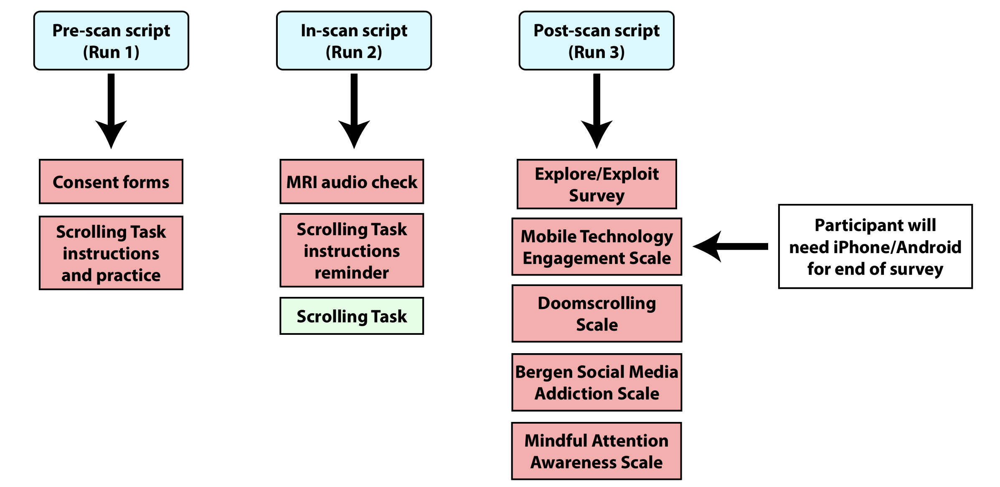

# SCNT_neuroimaging
These are all the scripts for the scrolling neuroimaging experiment, including the pre-scan, in-scan, and post-scan protocols.

The **scnt_neuroimaging_run_1_pre-scan** folder includes all the materials for the **pre-scan protocol**.

The **scnt_neuroimaging_run_2_in-scan** folder includes all the materials for the **in-scan protocol**.

The **scnt_neuroimaging_run_3_post-scan** folder includes all the materials for the **post-scan protocol**.

Here is a study design vignette that visualizes the pre-scan, in-scan, and post-scan protocols.

